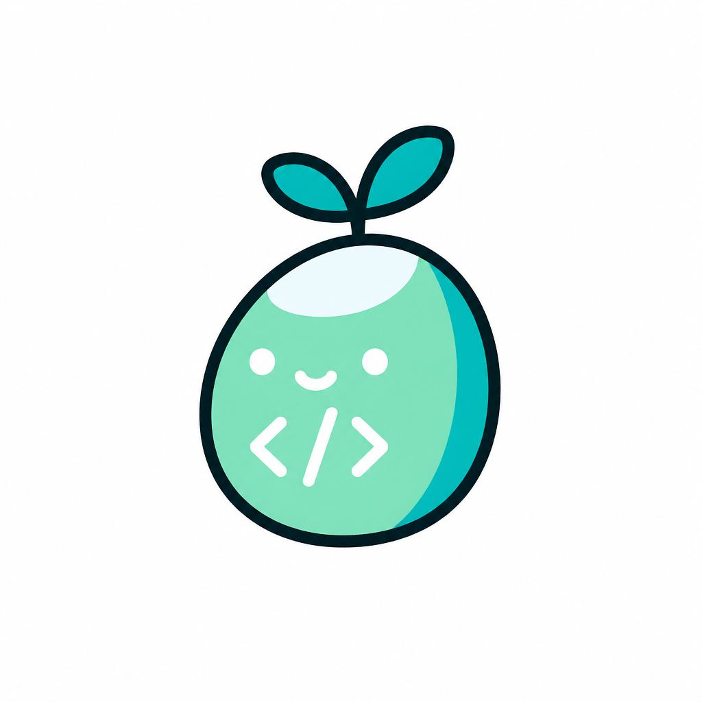
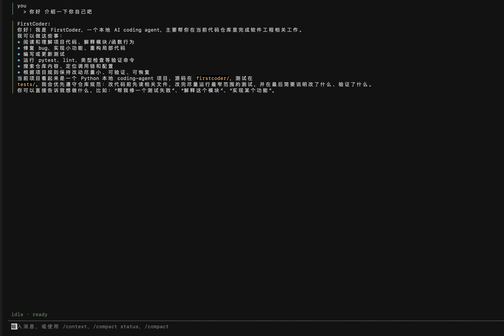
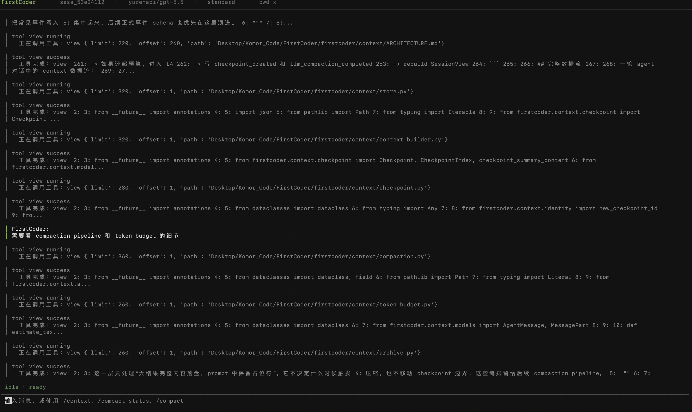

<p align="center">
  
</p>

<h1 align="center">FirstCoder</h1>

<p align="center">
  <strong>A local Python coding agent built to make agent internals visible.</strong>
</p>

<p align="center">
  <a href="#quickstart"></a>
  <a href="#tui"></a>
  <a href="#configuration"></a>
  <a href="#development"></a>
  <a href="https://deepwiki.com/KomorGiaoGiao/FirstCoder"></a>
</p>

<p align="center">
  English
  · <a href="README.zh-CN.md">简体中文</a>
</p>

---

FirstCoder is a real, runnable local coding agent with a Textual TUI, tool calling, permissions, sessions, and context compaction. It is designed to be useful in daily work and easy to study in code.

If you want to understand how coding agents actually work, FirstCoder keeps the moving parts visible instead of hiding them behind a black box.

- Learn the agent loop, tool calling, permissions, sessions, and context handling.
- Build on a small Python codebase with clear module boundaries.
- Use a local coding agent while still being able to inspect how it works.



## Why FirstCoder

Most coding-agent demos show the surface: a prompt goes in, code changes come out. FirstCoder focuses on the machinery in between.

Compared with larger projects like OpenCode, FirstCoder is intentionally smaller in scope. This repository keeps the core runtime in roughly 17k lines of Python, avoids a lot of extra platform surface area, and tries to preserve a better balance between practicality and readability.

The goal is not to out-feature a bigger coding agent. The goal is to keep the system real enough to use, but small enough that you can still read it end to end and understand why each subsystem exists.

It is built for people who want to:

- study how a coding agent is assembled
- modify or extend a local Python implementation
- understand the architecture well enough to explain it in an interview

Detailed subsystem design lives in the docs, not in this README.

## Quickstart

Install with `pipx`:

```sh
pipx install firstcoder
```

Start the TUI:

```sh
firstcoder
```

Run one message without opening the TUI:

```sh
firstcoder --message "Summarize this repository in one paragraph"
```

Use line-oriented interactive mode:

```sh
firstcoder --interactive
```

## What You Get

- Local Python coding agent
- Textual TUI that exposes agent activity instead of hiding it
- Tool calling with permission checks before risky actions
- Session persistence, resume flow, and context compaction
- Skills, provider adapters, and clean modules for study and modification

## Configuration

Create a starter config:

```sh
firstcoder config init
firstcoder config path
firstcoder config show
```

Keep secrets in environment variables:

```sh
export FIRSTCODER_API_KEY="your-api-key"
```

Default config locations:

```text
global:  ~/.config/firstcoder/config.toml
project: ./firstcoder.toml
```

## TUI

FirstCoder's TUI is designed to expose the agent loop instead of hiding it. You can see session state, streamed assistant output, tool calls, tool results, and permission prompts in one place.

Empty session:


Tool calls appear in the conversation flow:



Permission requests pause the agent until the user decides:


## Documentation

- [Technical Docs Index](docs/README.md)
- [Chinese Docs Index](docs/README.zh-CN.md)
- [Codebase Reading Guide](docs/CODEBASE_READING_GUIDE.md)

## Development

Install dev dependencies:

```sh
python -m venv .venv
.venv/bin/python -m pip install -e ".[dev]"
```

Run all tests:

```sh
.venv/bin/python -m pytest
```

Run a focused test file:

```sh
.venv/bin/python -m pytest tests/test_app_tui.py -q
```

## Philosophy

FirstCoder was built to answer a question most coding agents do not address:

> What actually happens inside when an agent streams, calls tools, asks for
> permission, compacts context, and resumes a session?

It is a real runnable agent, but it is also a readable Python project you can learn from one subsystem at a time.
